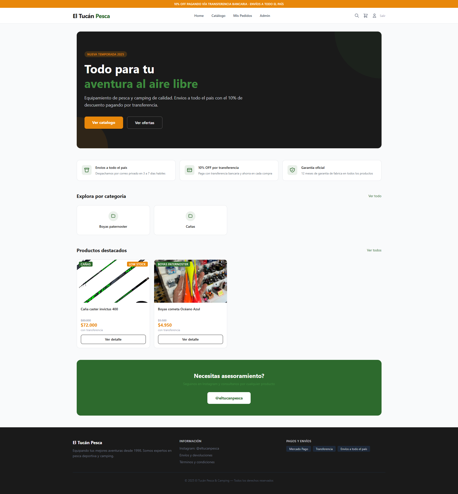
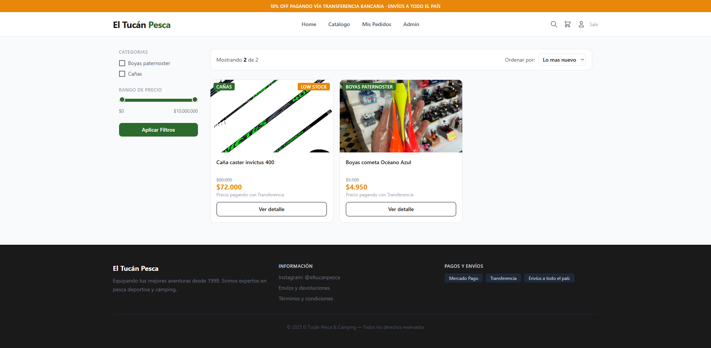
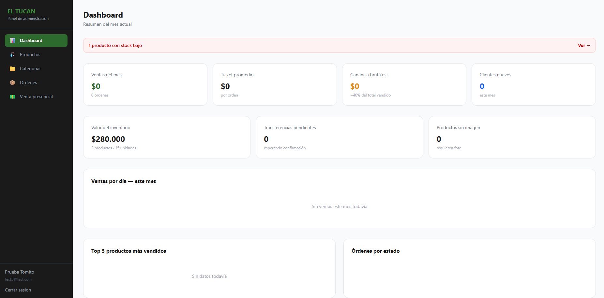
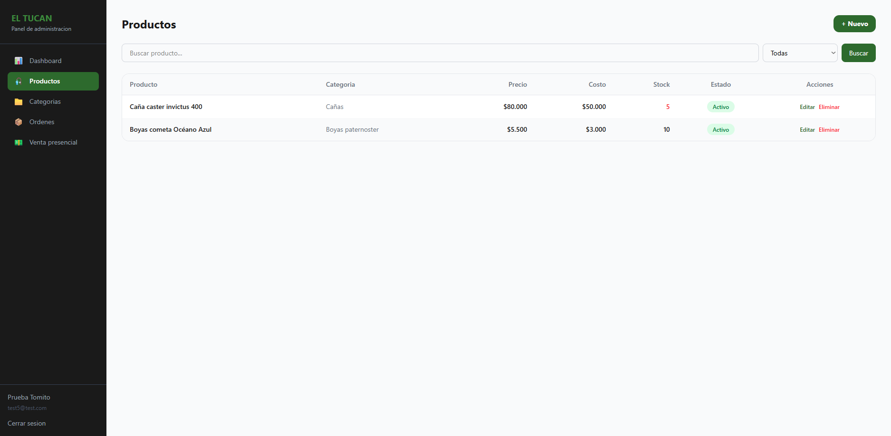

# 🦜 El Tucán Pesca & Camping

> E-commerce completo para un local de pesca y camping — desarrollado con React, Node.js y MongoDB.



---

## 🚀 Stack tecnológico

**Frontend**


**Backend**


**Infraestructura**


---

## 📋 Descripción

Plataforma de e-commerce full stack construida para un negocio real de venta de equipamiento de pesca y camping. El sistema permite a los clientes explorar el catálogo, filtrar productos, agregar al carrito y realizar pedidos. El dueño del local gestiona todo desde un panel de administración propio.

---

## ✨ Funcionalidades

### Tienda pública
- 🏠 **Home** con hero, beneficios, categorías y productos destacados
- 🔍 **Catálogo** con filtros por categoría, rango de precio (slider doble) y ordenamiento
- 📦 **Detalle de producto** con galería de imágenes, lightbox y productos relacionados
- 🛒 **Carrito** persistente en localStorage con resumen de compra
- 👤 **Autenticación** — registro, login y perfil de usuario
- 📋 **Mis pedidos** — historial de órdenes con estados en tiempo real

### Panel de administración
- 📊 **Dashboard** con métricas del mes, gráficos de ventas y alertas automáticas
- 🎣 **Gestión de productos** — CRUD completo con subida de hasta 5 imágenes por producto
- 📁 **Gestión de categorías** — CRUD inline sin cambiar de página
- 📦 **Gestión de órdenes** — máquina de estados con transiciones válidas
- 💵 **Venta presencial** — registro de ventas en el local que aparecen en las stats
- 🔒 **Rutas protegidas** por rol (admin/usuario)

---

## 🏗️ Arquitectura

```
ELTUCANPESCA/
├── backend/                  # API REST — Node.js + Express
│   └── src/
│       ├── config/           # Cloudinary
│       ├── controllers/      # Lógica de negocio
│       ├── middlewares/      # Auth, roles, rate limiting
│       ├── models/           # Schemas de Mongoose
│       ├── routes/           # Definición de endpoints
│       └── index.js          # Entry point + middlewares de seguridad
│
└── frontend/                 # SPA — React + Vite
    └── src/
        ├── components/       # Navbar, Layout, AdminLayout, PrivateRoute
        ├── context/          # AuthContext, CartContext
        ├── pages/            # Páginas públicas y admin
        └── services/         # Axios con interceptores JWT
```

**Comunicación**: El frontend consume la API REST del backend vía Axios. Los interceptores adjuntan el token JWT automáticamente en cada request y redirigen al login si el token expira (401).

---

## 🔒 Seguridad

- **Helmet** — headers HTTP seguros
- **CORS** — solo el dominio del frontend puede consumir la API
- **Rate limiting** — 100 req/IP/15min general, 50 intentos de login/15min
- **mongo-sanitize** — prevención de inyección NoSQL
- **JWT** — tokens con expiración configurable
- **bcryptjs** — hash de contraseñas con salt de 10 rounds
- **select: false** en campos sensibles (password, cost) — nunca se exponen por defecto
- **.env** protegido desde el primer commit — nunca en el repositorio

---

## 📸 Capturas

### Home


### Catálogo con filtros


### Panel de administración — Dashboard


### Panel de administración — Productos


---

## ⚙️ Variables de entorno

Crear un archivo `.env` en `/backend` con las siguientes variables (ver `.env.example`):

```env
PORT=
MONGODB_URI=
JWT_SECRET=
JWT_EXPIRES_IN=
CLOUDINARY_CLOUD_NAME=
CLOUDINARY_API_KEY=
CLOUDINARY_API_SECRET=
CLIENT_URL=
NODE_ENV=
```

---

## 🛠️ Instalación local

```bash
# Clonar el repositorio
git clone https://github.com/MartinianoGalarce/ELTUCANPESCA

# Backend
cd backend
npm install
npm run dev

# Frontend (en otra terminal)
cd frontend
npm install
npm run dev
```

El frontend corre en `http://localhost:5173` y el backend en `http://localhost:5000`.

---

## 🌐 Deploy

| Servicio | Plataforma |
|----------|-----------|
| Frontend | Vercel |
| Backend  | Render |
| Base de datos | MongoDB Atlas |
| Imágenes | Cloudinary |

---

## 📬 Contacto

Instagram: [@eltucanpesca](https://instagram.com/eltucanpesca)

---

*Desarrollado por [Martiniano Galarce](https://github.com/MartinianoGalarce)*
